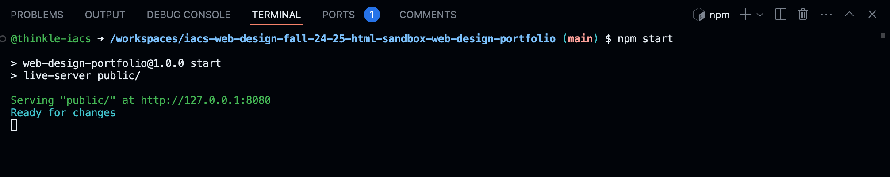
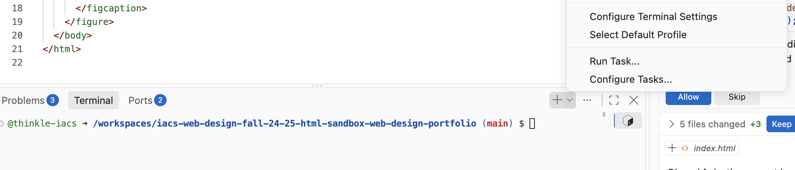
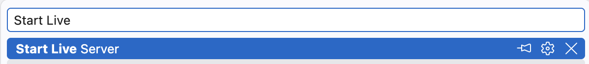
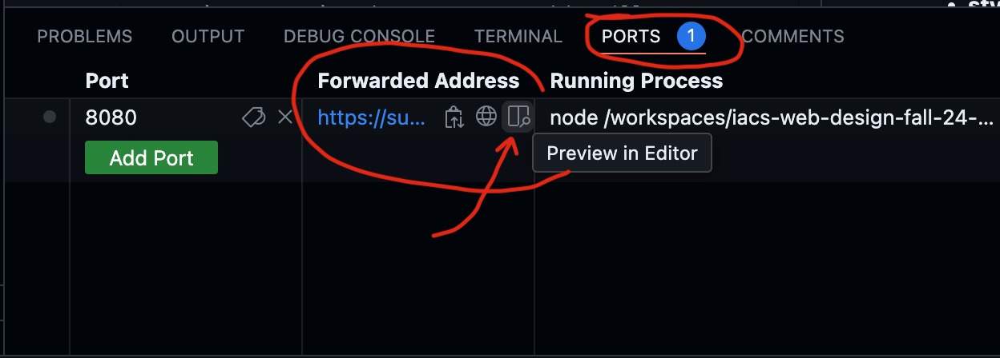
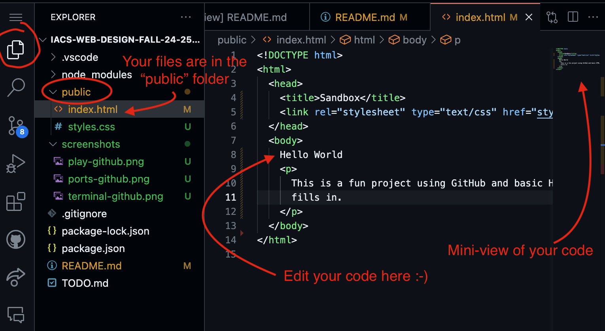
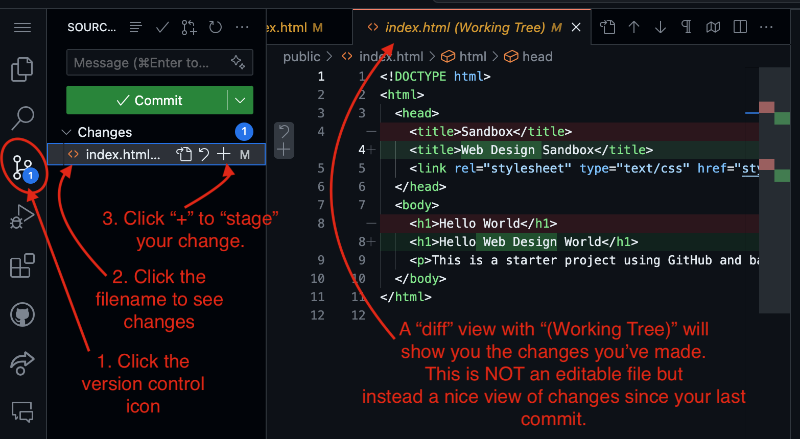
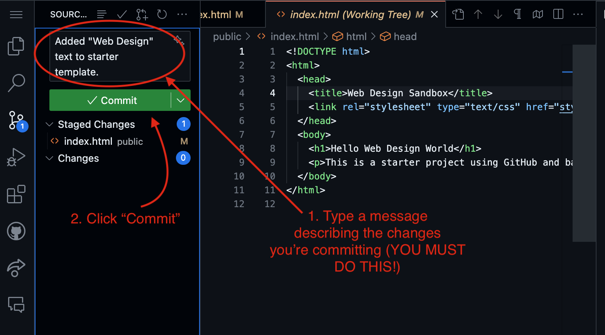
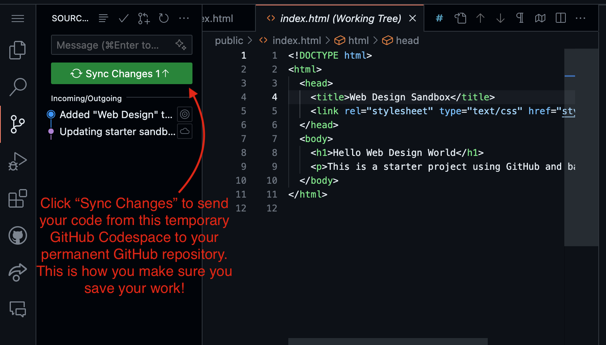
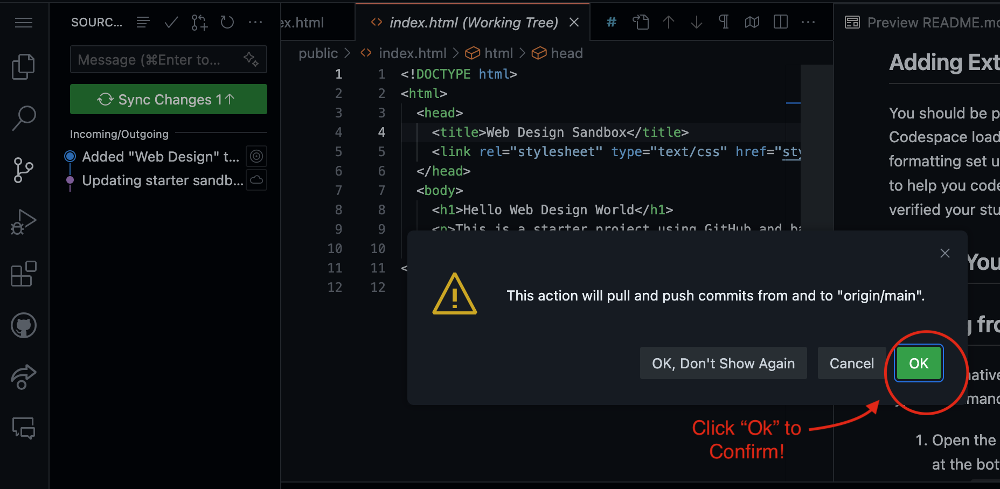

# Simple Web Design Project

Welcome to our simple web design sandbox! This project is designed to help you get started with HTML, CSS, and JavaScript in an easy-to-understand environment.

Instructions for understanding GitHub CodeSpaces are below.

In this document, you will find:

- [How to "run" your page](#running-the-project)
- [How to see your page side-by-side](#viewing-your-project)
- [Editing your files](#editing-your-project)
- [Setting up Codespaces Extensions](#adding-extensions)
- [Saving your work to version control](#saving-your-work-to-version-control)
- [Adding Images](#adding-images)

## Running the Project

1. Open the **Terminal** (use the "Terminal" tab at the bottom of the screen, or
   choose **Terminal → New Terminal** from the menu).
2. Type `npm start` and press Enter. This starts a local web server for your page.
   
3. Leave that terminal running while you work. Every time you save a file, your
   page will reload automatically. (To stop the server, click in the terminal
   and press `Ctrl+C`.)

If typing the command doesn't work, you can also open the **Terminal** menu,
choose **Run Task**, and select **Start Live Server**.

## Viewing Your Project

- You should see a pop up asking if you want to open the page after you run `npm start`. If you click on it, it will open your webpage in a new tab.
- You can also click on "Ports" (port `5500`) at the bottom of the screen to see the web connection on your computer.

  If you hover over the "Forwarded Address" column, you'll see a "side-by-side" icon that will show
  the webpage inside your coding editor, or a "Globe" icon that will show the page inside your web
  browser in a new tab.

## Editing Your Project

- Choose the "File Explorer" tab to see your files in the project root.
  

- **index.html**: This is your HTML file. Edit it to change the structure of your web page.
- **styles.css**: This is your CSS file. Modify it to change the styling of your web page.

### Files You Can Ignore

You don't need to worry about the following files and folders. They are used to set up and run your project environment:

- `package.json` and `package-lock.json`: Configuration files for Node.js. They are hidden from the Explorer.
- `node_modules`: A folder containing all the packages and dependencies for the project.
- `.vscode`: Contains configuration files for Visual Studio Code. It is hidden from the Explorer.

These files are hidden in the editor to keep the student workspace focused. They are still part of the repository and are not a security boundary.

## Adding Extensions

You should be prompted to install extensions when this Codespace loads -- say yes and you'll
get automatic code formatting set up as well as GitHub Copilot (an AI tool to try to help you code). (To get CoPilot you'll need to have verified your student account with github)

## Saving Your Work to Version Control

Your "Codespace" is temporary (GitHub will keep it around for only a few weeks if you aren't using it actively), so you need to always save your work to version control after you are done.

GitHub version control can store all of your work as well as every change you've "committed", which means you can go back in time and see what changes
you made.

When you make changes to files, you will see the number of uncommitted changes you've made show up on the version control icon on the sidebar.

1. Click on the version control icon to see what changes you've made. Then click "+" to "stage"
   the change (you could also undo your changes here
   if you wanted to go back to the last committed
   version in the future)
   

2. Type a "change log" message describing what you changed in your code and then click "Commit" to save your changes to your local version control.
   

3. Click "Sync Changes" to push your changes from the local GitHub Codespace to your permanent GitHub repository. You'll have to click a confirmation popup as well.
   
   

## Adding Images

### Naming Images

I recommend giving images simple filenames with no spaces or special characters.
You can rename images in GitHub by selecting the file and pressing "Enter" or choosing
"Rename" from the right-click menu.

### Image Rights

Before you upload images to your project, you should make sure you have the right to
use them, either because you created them yourself, or because you found an image in
the public domain or with a creative commons license that allows re-use. Wikipedia
or the Wikimedia commons can be good sources of reusable images.

### Adding Images to GitHub CodeSpaces

You can add images or other files to your project in GitHub Codespaces either
by dragging and dropping them onto the File Explorer or by using the right-click
menu and selecting upload.

If you put files in the wrong place, you can drag-and-drop to move them.

Put the images you want to use in the `images` folder. Then you can use them
in your page with a path like `images/my-picture.jpg`.
